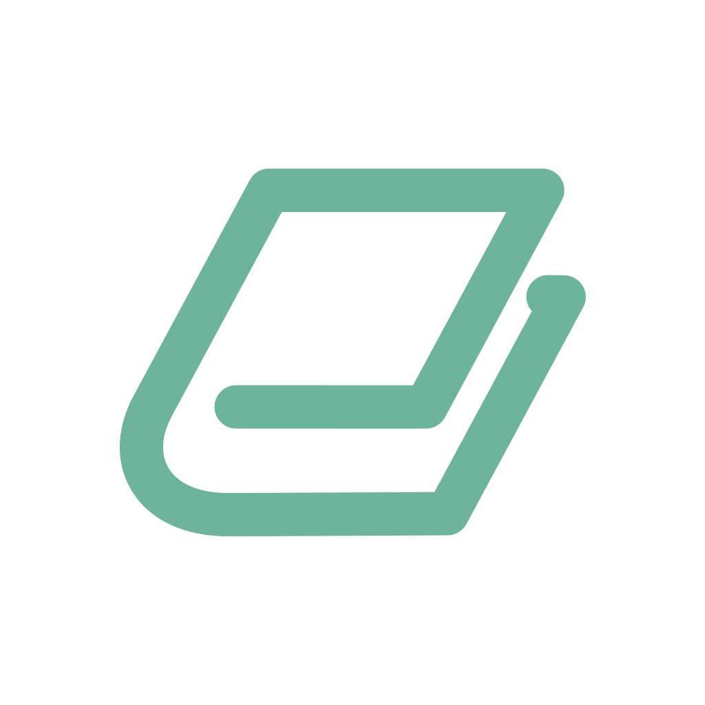

TsunDocs
========

Use TsunDocs to save and manage your favorite news, articles, video, web pages... etc. All links are shared in all your iOS/iPadOS devices.

- Create your own Tags to organize and manage your articles.
- Synchronize all information on all your iOS/iPadOS devices.
- Mark as read/unread your articles to filter.
- Support Dark Mode.

## License

MIT License
